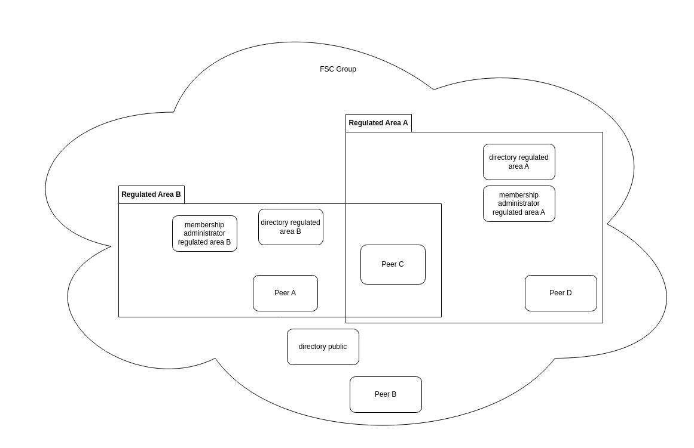

# Architecture

## Registering a Peer {#registering_a_peer}

To register, the Peer needs to create a Contract with a [PeerRegistrationGrant](#peer_registration_grant). The PeerRegistrationGrant contains information about the Peer. The Contract with the `PeerRegistrationGrant` is submitted to one of the Membership Administrators of the Regulated Area.
Once the Contract between Peer and one of the Membership Administrators is signed by both parties the Peer is considered a member within the Regulated Area.

1. The Peer creates a Contract with a Peer Registration Grant
2. The Peer adds its own accept signature to the Contract
3. the Peer sends the Contract and accept signature to one of the Membership Administrators
4. the Membership Administrator adds its own accept signature
5. the Membership Administrator sends the accept signature to the Peer

## Regulated Area 

Without further restrictions all Peers within a Group are allowed to create Contracts with all other Peers in the Group for all Services.
The Peer receiving the Contract always has the option to Reject a Contract thereby denying access. 
However, in certain use cases this is not enough. For certain scenarios an additional governing party is needed verifying and approving membership for additional regulation.
For example a Peer might need to meet certain legal requirements before becoming a member.

A Regulated Area restricts the ability to create Contracts for a set of Services to only Peers that are a member of the Regulated Area.
E.g. once a member of this Regulated Area all Services within this Regulated Area are allowed.

For example,
A FSC Group has the following Peers:
* Peer A
* Peer B
* Peer C
* Peer D
* public_directory
* Directory Regulated Area A
* Directory Regulated Area B
* membership administrator Regulated Area A
* membership administrator Regulated Area B

Within this FSC Group two Regulated Areas have been established (A and B), where Regulated Area A is governed by membership administrator A and Regulated Area B is governed by membership administrator B.
This can be graphically depicted as:

In this theoretical setup:

* the public Directory is available to and for all Peers within the Group. Ergo, all Peers have the possibility to publish Services in this Directory. And all Peers can discover Peers in this Directory. Also, all peers in this Group have announced themselves to this Directory.
* the Directory Regulated Area A is only available for members of the Regulated Area A. Ergo, only Peers that are member of the Regulated Area are allowed to Publish Services in this Directory and discover Peers in this Directory. Also, Peers that are member of the Regulated Area A have announced themselves to this Directory.
* the Directory Regulated Area B is only available for members of the Regulated Area B. Ergo, only Peers that are member of the Regulated Area b are allowed to publish Services in this Directory and discover Peers in this Directory. Also Peers that are member of the Regulated Area B have announced themselves to this Directory.
* the Membership Administrator A governs the membership of the Regulated Area A
* the Membership Administrator B governs the membership of the Regulated Area B
* org_a is a member of Regulated Area B and can use Services within the Regulated Area B as well as Services published in the public Directory.
* org_b is not a member of any Regulated Areas and therefore can only use Services published in the public Directory.
* org_c is a member of Regulated Area A and Regulated Area B and can use Services within the Regulated Area A as well Regulated Area B as well as Services published in the public Directory.
* org_d is a member of Regulated Area A and can use Services within the Regulated Area A as well as the Services published in the public Directory.

### Membership restriction

A member of the Regulated Area is allowed to:

* Create a Contract with a Service Connection Grant to a Service provided in the Regulated Area
* Create a Contract with a Delegated Service Connection Grant as a Service Provider (delegatee) in the Regulated Area
* Create a Contract with a Delegated Service Connection Grant as a Delegator in the Regulated Area
* Create a Contract with a Service Publication Grant in the Directory of the Regulated Area
* Create a Contract with a Delegated Service Publication Grant in the Directory of the Regulated Area as service provider
* Create a Contract with a Delegated Service Publication Grant in the Directory of the Regulated Area as Delegator
* Create a Contract with a Service Publication Grant in the Directory of the Regulated Area

For the grants `DelegatedServiceConnection` and `DelegatedServicePublication` the Membership Administrator **MUST** define in the [Profile](#profiles) whether the Delegatee must also be a member of the Regulated Area.

### Creating a Regulated Area

A Regulated Area is an area within a Group where only members are allowed to use and publish services.
In order to create a Regulated Area the Group containing the Regulated Area **MUST** have a [Profile](#profiles) containing at least the mandatory decisions.
Additional rules which are not listen as mandatory **COULD** also be included in the `Profile`.

Additional decisions around the Regulated Area **COULD** be made.

When no additional restrictions are defined governing membership into the Regulated Area a Membership administrator only has to sign the Contracts providing only insights into its members.
providing no additional membership restrictions may seem counterintuitive, however, this could still provide some valuable functionality. 
For example, when all members of a Regulated Area are automatically granted access to all Services within the Regulated Area the operational effort of creating and signing Contracts for each individual Service is no longer needed.

## Regulated Area Membership validation

Membership of the Regulated Area is validated on two levels.
* a Membership administrator validates whether a Peer is (still) applicable for membership
* each Peer in the Regulated Area **MUST** validate Contracts received from other Peers for Services in the Regulated Area. I.e. validate that other Peers are still valid members of the Regulated Area.
* each Peer in the Regulated Area **MUST** validate a Peer is still a member of a Regulated Area before issuing an Access Token for a Service in a Regulated Area.

Membership is evaluated when a Membership Administrator receives a Contract with a Peer Registration Grant from a Peer. 
Specific membership criteria, if any, are evaluated by a Membership Administrator and when the Peer is allowed membership the Contract containing the Peer Registration Grant is Accepted by a Membership Administrator.
The membership criteria can be evaluated periodically by the Membership administrators. 

Any specifics regarding evaluation criteria and periodical re-evaluation **MUST** be part of the *Profile* (TODO consider other term to avoid confusion with the FSC Core Profile) of the Regulated Area.
Peers receiving Contracts for Services part of the Regulated Area **MUST** validate the Peers mentioned in the Contracts against the Membership Administrators. Thereby only allowing access to Peers that are a member of the Regulated Area.

Peers receiving Contracts with a [ServicePublicationGrant](https://logius-standaarden.github.io/fsc-core/#service_publication_grant), a [DelegatedServicePublicationGrant](https://logius-standaarden.github.io/fsc-core/#grant_delegated_service_publication), a [ServiceConnectionGrant](https://logius-standaarden.github.io/fsc-core/#service_connection_grant) or a [DelegatedServiceConnectionGrant](https://logius-standaarden.github.io/fsc-core/#grant_delegated_service_connection) for a Service in a Regulated Area **MUST** verify that the Peers on the Contract are returned in the `GET /members` endpoint of the Membership Administrator(s) specified in the Grant.

### Verifying a Contract with a ServiceConnectionGrant

1. the Peer who wants to connect to a Service submits a Contract with a Service Connection Grant
2. the Peer providing a Service verifies if the Contract adheres to the rules defined by a Membership Administrator
3. if the Contract adheres to the rules, the Peer providing the Service adds its own accept signature 
4. if the Contract does not adhere to the rules, the Peer providing the Service adds its own reject signature 
5. the Peer providing the Service sends the Contract with the Signature to the Peer who has Submitted the Contact

### Verifying a Contract with a ServicePublicationGrant

1. the Peer who wants to publish a Service submits a Contract with a Service Publication Grant to the Directory of the Regulated Area
2. the Peer acting as Directory for the Regulated Area verifies if the Contract adheres to the rules defined by a Membership Administrator
3. if the Contract adheres to the rules, the Peer acting as the Directory for the Regulated Area adds its own accept signature
4. if the Contract does not adhere to the rules, the Peer acting as Directory for the Regulated Area adds its own reject signature
5. the Peer acting as Directory sends the Contract with the Signature to the Peer who has Submitted the Contact

## Regulated Area Membership revocation

Membership to a Regulated Area can also be revoked by a Membership Administrator. 
Peers providing Services **MUST** periodically synchronize with the Membership Administrator to retrieve the latest members and **MUST** deny access to all Peers removed from the members response.
The specific time period on which the members are synchronized in determined in the profile of the Regulated Area.

## Multiple Membership Administrators

It is possible to allow multiple Membership Administrators within one Regulated Area. This could be beneficial if for example one Membership Administrator is suited for verifying members of a specific branch or sector, while another validates Peers belonging to another sector. 

When creating Contracts, only one Membership Administrator is allowed per Grant. 

### Creating or adding a new Membership Administrator

In order to become a Membership Administrator for a Regulated Area a Peer creates a Contract with a Peer Registration Grant adding the role Membership Administrator.
When the Membership Administrator accepts this Contract the Peer becomes a Membership Administrator for the Regulated Area.

### Synchronizing Membership Administrators

Multiple Membership administrators in a Regulated Area act in a federated manner. Specifically, this means each Membership Administrator contains the entire members list of all members in the Regulated Area.
Peers who want to get the members list for a Regulated Area can request this by one of the Membership Administrators. It is recommended the Peer uses the Membership Administrator to whom the Peer has submitted the PeerRegistrationGrant.
Since this Membership Administrator is known and trusted by the Peer.

